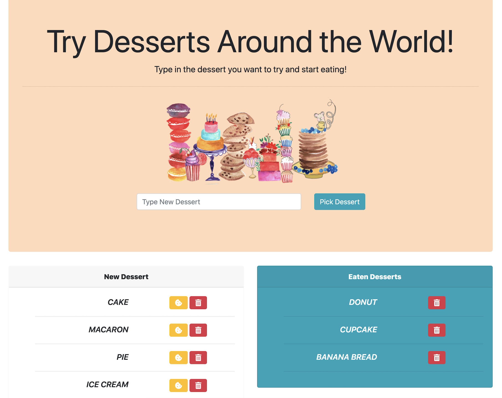

# Eat the Desserts

### Everyone is having burgers but we are eating Desserts!

The assignment is an application that has the ability to GET, POST, and DELETE information on a database based off of the client side interations and is deployed on Heroku.

There use can enter any DESSERT name which will add it to the markee of **"New Desserts"**, which is on the left sid of the page. This also adds the dessert to the MySQL database. The user then has the options of **eating** the dessert by pressing the cookie or **deleting** the dessert by clicking the trash can.

Once the cookie is clicked the item will be moved to the **"Eaten Desserts"**. Here you can leave the desserts there to remember which you have eaten or delete them to keep it your little secret shhhhh....

## Screenshot

==============

## Technologies Required for Homework:

- jQuery
- Node.js
- Express.js
- Handlebars.js
- mySQL Database
- body-parser
- express
- express-handlebars
- Heroku
- JawsDB

## Demo applications here:

https://stormy-oasis-60466.herokuapp.com/

##### Issues:

One issue I did find is that I have to delete them in order. So the desserts listed in "New Dessert" have to be deleted from the top down and then you can delete the desserts in "Eaten Desserts" from top down.
